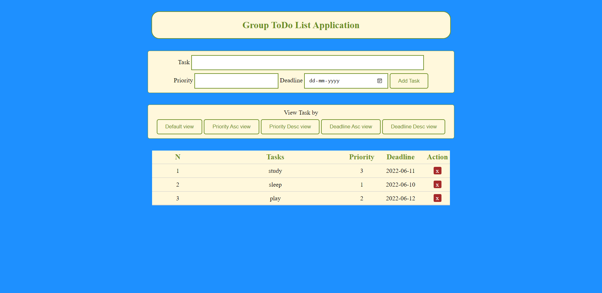

# Group ToDo List Application
This is a Group ToDo List that will help a group to keep track of tasks to be done. A priority number (1 being most important) as well as the deadline is assigned to the task by any member of the group. Any member of the group can delete the task once it is completed.

## Requirements
* Xampp
* Python (If you are running the create_table_format.py file)
* Pymysql (If you are running the create_table_format.py file)

## Steps to run
1. Place this repository in xampp>htdocs folder 
2. Run Apache and MySQL via xampp
3. Create a database for this application (you can name the db as 'todo' for ease in step 4)
4. Run the create_table_format.py (change the db name on line 7 in the .py file, if you haven't kept it 'todo')
5. Finally go to your browser and type http://localhost:portnumber/repo_name/

## Image of the Project

## Drawbacks
* No Registration or Login system, thus, if hosted/deployed, anyone with the link can access it. 
* No Account System, thus the group won't know which member added or deleted the task.
* There could be chances of security issues like malicious attacks, if hosted/deployed.

## Reference
https://codewithawa.com/posts/to-do-list-application-using-php-and-mysql-database